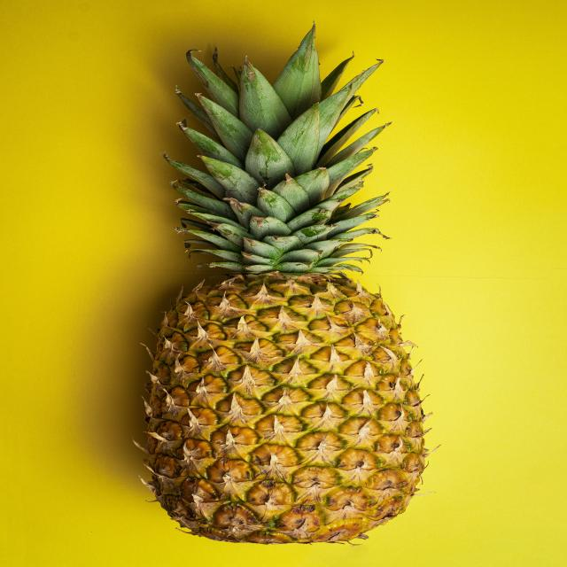
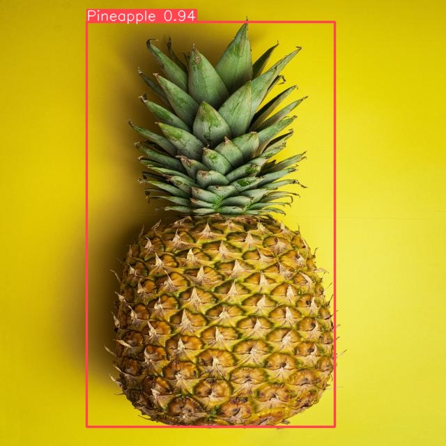
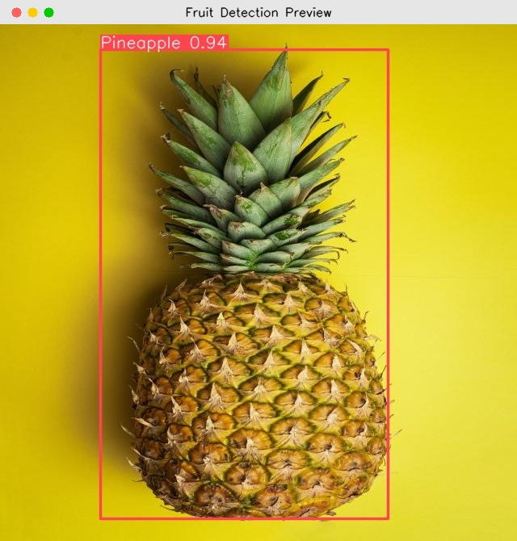

# Fruit Detection YOLOv8

Project ini dibuat untuk mendeteksi berbagai jenis buah menggunakan metode object detection berbasis YOLOv8. Model akan mengenali objek pada gambar dan menampilkan hasil deteksi berupa bounding box beserta label nama buah.

## Hasil Deteksi (Visualisasi)

Berikut adalah contoh performa model dalam mendeteksi buah (Nanas/Pineapple) beserta simulasi tampilan *popup* interaktifnya:

### 1. Sebelum Deteksi (Before Detection)
Gambar mentah dari dataset test.


### 2. Sesudah Deteksi (After Detection)
Model AI berhasil mengenali objek nanas dan menggambar kotak deteksi (*bounding box*) dengan akurasi yang tinggi.


### 3. Tampilan Aplikasi (Popup Inference)
Tampilan pop-up interaktif yang akan muncul saat menjalankan script inference.


---

## Cara Menjalankan Project

### 1. Persiapkan Environment
Pastikan Python dan virtual environment sudah tersedia.
Aktifkan virtual environment terlebih dahulu:
```bash
source venv/bin/activate
```
*Jika menggunakan interpreter langsung dari folder venv, langkah ini bisa dilewati.*

### 2. Siapkan Dataset
Dataset awal yang kita punya belum memiliki kotak deteksi (bounding box) yang dibutuhkan oleh YOLO. Dataset perlu diproses terlebih dahulu agar sesuai dengan format YOLO:
```bash
python prepare_dataset.py
```
Tunggu sebentar sampai muncul tulisan "Dataset preparation complete."

### 3. Latih Model AI (Training)
Setelah datasetnya siap, saatnya melatih model AI agar bisa mengenali buah-buahan tersebut:
```bash
python train.py
```
Proses ini akan memakan waktu beberapa menit. Setelah selesai, model terbaiknya akan otomatis tersimpan di dalam folder `runs/detect/`.

Berikut adalah konfigurasinya:
- **Model**: Menggunakan `yolov8n.pt` (versi nano/kecil) yang diinisialisasi dari bobot model yang sudah dilatih sebelumnya (pre-trained).
- **Data**: Menggunakan konfigurasi dataset `dataset/data.yaml`.
- **Epochs**: Pelatihan dilakukan sebanyak **10 epoch**.
- **Image Size**: Resolusi gambar input diubah menjadi **320x320** piksel.
- **Batch Size**: Model memproses **16 gambar** secara bersamaan dalam sekali iterasi.
- **Device**: Pelatihan diarahkan ke perangkat **MPS (Metal Performance Shaders)**.
- **Name**: Hasil pelatihan disimpan dalam sub-folder `runs/detect/fruit_detector`.

### 4. Lihat Hasilnya
Mari kita tes seberapa pintar AI yang sudah kita latih tadi. Jalankan script ini:
```bash
python inference.py
```
**Cara pakai:**
- Jendela baru akan otomatis terbuka menampilkan gambar buah lengkap dengan kotak dan tebakan nama buahnya.
- Tekan **Spasi** atau **Enter** di keyboard untuk melihat gambar selanjutnya.
- Kalau sudah selesai atau mau keluar, tinggal tekan huruf **'q'**.
